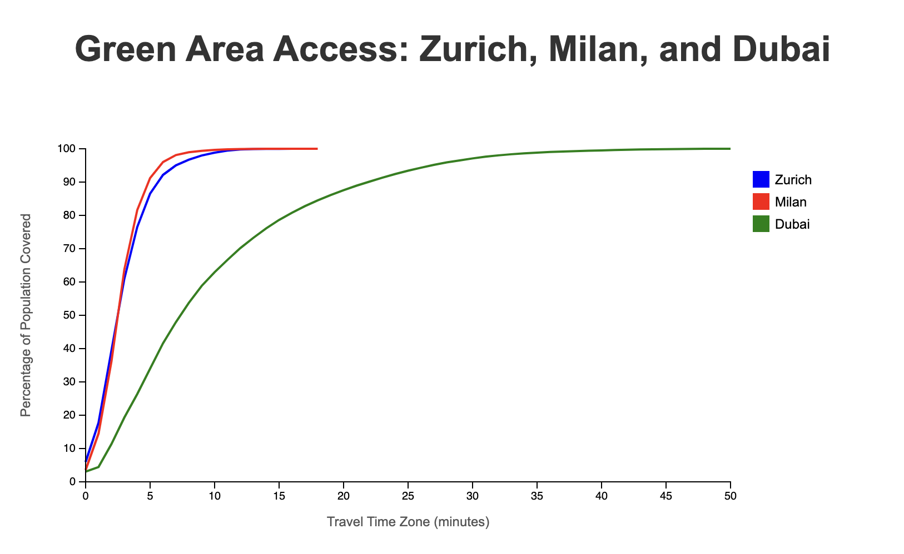

#AccessMod + GPP

## 🌟 Project Overview

This project utilizes AccessMod to compute travel times to various OpenStreetMap (OSM) features, such as green areas, parks, nature reserves, and other leisure spaces. It's designed to assess the accessibility of features, e.g. public green spaces in urban environments.

Developed by the GeoHealth team at the University of Geneva, this tool combines the power of AccessMod's travel time modeling with the extensive feature data available in OpenStreetMap.

Project Repository: [https://github.com/unige-geohealth/accessmod_gpp](https://github.com/unige-geohealth/accessmod_gpp)


## 🔑 Key Features

- 📊 Fetches and processes geospatial data using the inaccessmod package
- ⏱️ Utilizes AccessMod's replay mode for travel time analysis
- 🏙️ Supports analysis for multiple cities
- 🧩 Modular structure for step-by-step data processing and analysis

## 📋 Prerequisites

- 🐳 Docker
- 💻 Bash shell

## 🚀 Installation

1. Clone the repository:

```
git clone https://github.com/unige-geohealth/accessmod_gpp.git
cd accessmod_gpp
```

2. Ensure Docker is installed and running on your system.

## 🔧 Usage

Run the main script:

```
./start.sh
```

This script will guide you through the following steps:

1. Select a city for analysis
2. Choose whether to run in development mode
3. Select which part of the analysis to run:
   - 01_get_data: Fetch required geospatial data
   - 02_build_merged_landcover: Process and merge landcover data
   - 03_create_start_points: Generate starting points for analysis
   - 04_travel_time: Perform travel time calculations using AccessMod

## 📁 Project Structure

- `01_get_data`, `02_build_merged_landcover`, `03_create_start_points`, `04_travel_time`: Contain scripts for different stages of data processing and analysis
- `helpers`: Utility scripts
- `data`: Main data directory, includes subdirectories for each analyzed city

## 🔗 Dependencies

- AccessMod (version 5.8.3-alpha.1)
- inaccessmod package (latest version)

## 💻 Development

To enter development mode, select 'y' when prompted "Do you want to develop?". This will give you a bash shell in the Docker container for debugging and development purposes.

## 🤝 Contributing

We welcome contributions to this project. Please feel free to submit issues and pull requests.

## 📄 License

[Insert appropriate license information here]

## 📞 Contact

For more information, please contact the GeoHealth team at the University of Geneva.

## 📊 Sample Results

[dummy model]

Below is a plot showing the Percentage of Population Covered vs Travel Time Zone (in minutes) for three sample cities: Dubai, Milan, and Zurich.



This plot demonstrates how the percentage of the population with access to green public spaces increases as the travel time increases. It provides a visual comparison of accessibility across different urban environments.

Key observations:
- Zurich and Milan show comparable access to green spaces, with similar curves on the graph.
- Dubai demonstrates significantly less access to green spaces, requiring inhabitants to travel much further to reach these areas.
- The stark difference between Dubai and the European cities highlights how urban planning and geography can impact access to green spaces.

This type of analysis can help urban planners and policymakers understand and improve access to green spaces in their cities.
